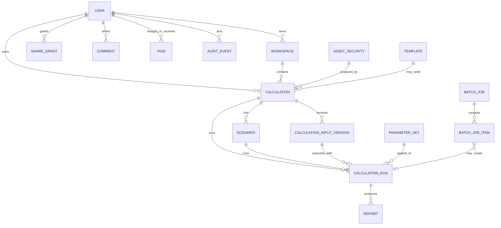
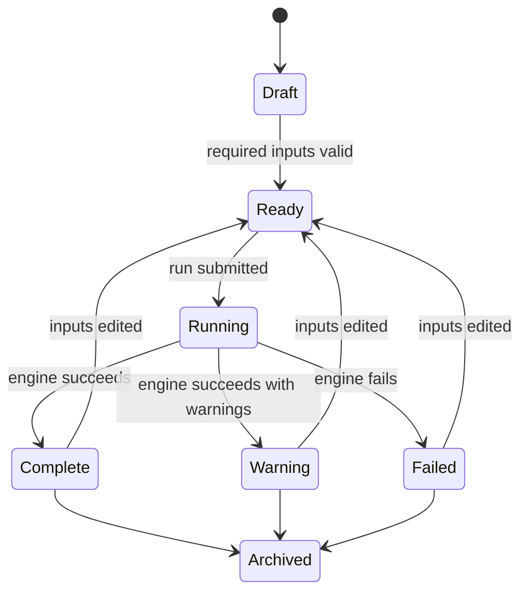
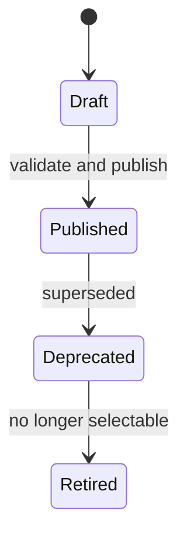

# Data Model Scaffold

## 1. Purpose

This document describes the application data model before implementation. It is intended to support Oracle persistence, reproducible calculation runs, role-based access, object-level permissions, collaboration, reports, batch processing, and auditability.

The model uses relational entities for governance-critical records and JSON payloads only where the input/output shape is intentionally flexible.

## 2. Entity Relationship Overview

## 3. Core Entity Groups

| Group | Entities |
|---|---|
| Identity and access | User, Role/Status, Share Grant, Permission Policy. |
| Workspace and deal objects | Workspace, Asset/Security, Calculation, Scenario. |
| Calculation provenance | Calculation Input Version, Parameter Set, Calculation Run, Calculation Engine Version. |
| Output and reporting | Report, Export Event, Output Snapshot. |
| Collaboration | Comment, Task, Notification. |
| Batch processing | Batch Job, Batch Job Item, Batch Upload Template. |
| Governance | Audit Event, Template, Reference Data Snapshot. |

## 4. Entity Definitions

### 4.1 User

Represents a person who can authenticate and use the application.

| Field | Notes |
|---|---|
| user_id | Primary identifier. |
| full_name | Required display name. |
| soeid | Unique login identifier. |
| password_hash | Stored only on backend; never returned to frontend. |
| role | BUSINESS_USER or ADMIN for first release. |
| status | PENDING, ACTIVE, DISABLED. |
| created_at / updated_at | Audit timestamps. |
| last_login_at | Optional until first login. |

Rules:

- Users cannot self-assign admin role.
- Pending users cannot access authenticated app areas.
- Disabled users cannot create sessions.
- Password hashes are never included in API responses or audit metadata.

### 4.2 Workspace

Container for a user's calculation work.

| Field | Notes |
|---|---|
| workspace_id | Primary identifier. |
| owner_user_id | User who owns the workspace. |
| name | Default can be the user's name plus "Workspace." |
| description | Optional. |
| created_at / updated_at | Timestamps. |

Rules:

- A business user's personal workspace is private unless shared or accessed by admin.
- Admins may view workspaces for support and oversight.

### 4.3 Asset / Security

Business object being analyzed.

| Field | Notes |
|---|---|
| asset_security_id | Primary identifier. |
| identifier | Ticker, CUSIP, ISIN, internal ID, or placeholder. |
| identifier_type | CUSIP, ticker, internal, other. |
| name | Human-readable name. |
| asset_type | Loan, bond, equity, structured asset, other. |
| currency | Optional. |
| metadata_payload | Flexible metadata. |
| source | Manual, upload, reference data, admin. |
| created_at / updated_at | Timestamps. |

Rules:

- The first release can support manually created assets.
- Identifier uniqueness should be scoped by identifier type where possible.
- Asset metadata should not become a dumping ground for calculation inputs.

### 4.4 Calculation

Saved business object representing a calculation workspace for one asset/security.

| Field | Notes |
|---|---|
| calculation_id | Primary identifier. |
| workspace_id | Parent workspace. |
| owner_user_id | Owner. |
| asset_security_id | Asset/security analyzed. |
| template_id | Optional source template. |
| name | User-facing name. |
| description | Optional. |
| status | Draft, ready, running, complete, warning, failed, archived. |
| current_input_version_id | Latest selected input version. |
| current_run_id | Latest selected run. |
| created_at / updated_at | Timestamps. |

Rules:

- Historical runs are never overwritten.
- Current run is a pointer, not the only result.
- Deleting should be soft delete or archived if audit retention is required.

### 4.5 Calculation Input Version

Immutable version of the inputs used or prepared for a calculation.

| Field | Notes |
|---|---|
| input_version_id | Primary identifier. |
| calculation_id | Parent calculation. |
| version_number | Sequential per calculation. |
| input_payload | Structured JSON payload. |
| input_hash | Hash of canonicalized input payload. |
| created_by_user_id | User who created it. |
| created_at | Timestamp. |

Rules:

- A run references a specific input version.
- Editing inputs creates a new version.
- Input hash is used for reproducibility and audit comparison.

### 4.6 Scenario

Named variation of a calculation.

| Field | Notes |
|---|---|
| scenario_id | Primary identifier. |
| calculation_id | Parent calculation. |
| base_scenario_id | Optional derivation link. |
| name | Base case, downside, upside, custom. |
| override_payload | Only changed fields when derived from a base. |
| created_by_user_id | Creator. |
| created_at / updated_at | Timestamps. |

Rules:

- Scenario runs should still resolve to a complete input payload at execution time.
- Scenario comparison should use run records, not live recalculation.

### 4.7 Parameter Set

Versioned admin-controlled calculation assumptions.

| Field | Notes |
|---|---|
| parameter_set_id | Primary identifier. |
| name | Example: Tax Methodology. |
| version | Business-facing version. |
| status | Draft, published, deprecated, retired. |
| effective_date | First applicable date. |
| expiration_date | Optional. |
| payload | Structured parameter values such as tax rates and methodology assumptions. |
| payload_hash | Hash of canonical payload. |
| created_by_user_id | Admin/SME. |
| published_by_user_id | Admin/SME. |
| created_at / published_at | Timestamps. |

Rules:

- Published parameter sets are immutable.
- Drafts can be edited.
- Deprecation stops future use but does not break historical runs.
- Every run must reference the exact parameter set version used.

### 4.8 Calculation Run

Specific execution of the calculation engine.

| Field | Notes |
|---|---|
| calculation_run_id | Primary identifier. |
| calculation_id | Parent calculation. |
| scenario_id | Optional. |
| input_version_id | Exact input version. |
| parameter_set_id | Exact parameter set version. |
| engine_version | Calculation engine version. |
| status | Queued, running, completed, completed_with_warnings, failed, cancelled. |
| result_payload | Structured output JSON. |
| error_payload | Structured error JSON if failed. |
| warning_payload | Structured warnings. |
| started_at / completed_at | Timestamps. |
| executed_by_user_id | User who initiated run. |
| request_id | Trace/request correlation. |

Rules:

- Rerun creates a new run record.
- Failed runs preserve structured error details.
- Completed runs preserve output and provenance.
- The application must distinguish technical success from business-clean success.

### 4.9 Report

Generated artifact from a run.

| Field | Notes |
|---|---|
| report_id | Primary identifier. |
| calculation_run_id | Source run. |
| report_type | Summary, full report, values-only, audit packet. |
| format | PDF, XLSX, CSV, HTML, JSON as allowed. |
| storage_reference | Document location or persisted payload reference. |
| metadata_payload | Generation metadata. |
| created_by_user_id | User who generated it. |
| created_at | Timestamp. |

Rules:

- Report generation is permission controlled.
- Values-only export is distinct from full output export.
- Every report/export action should create an audit event.

### 4.10 Share Grant

Object-level permission granted to another user.

| Field | Notes |
|---|---|
| share_grant_id | Primary identifier. |
| resource_type | Calculation, scenario, report, batch job, workspace. |
| resource_id | Target resource. |
| grantee_user_id | User receiving access. |
| permission_level | Owner, view, edit, export_values, admin_full. |
| granted_by_user_id | Granting user. |
| created_at | Timestamp. |
| revoked_at | Optional. |

Rules:

- Revoked grants no longer authorize access.
- Backend authorization must evaluate ownership, active share grant, and admin role.
- Export permissions should be narrower than view/edit permissions.

### 4.11 Comment

Discussion attached to a resource.

| Field | Notes |
|---|---|
| comment_id | Primary identifier. |
| resource_type / resource_id | Attached object. |
| body | Comment content. |
| created_by_user_id | Author. |
| created_at / updated_at | Timestamps. |

Rules:

- Comments are visible only to users with resource access.
- Comment edits should be auditable if policy requires.

### 4.12 Task

Workflow item linked to a resource.

| Field | Notes |
|---|---|
| task_id | Primary identifier. |
| resource_type / resource_id | Attached object. |
| title | Required. |
| description | Optional. |
| assigned_to_user_id | Assignee. |
| assigned_by_user_id | Assignor. |
| status | Open, in_progress, blocked, complete, cancelled. |
| due_date | Optional. |
| created_at / updated_at | Timestamps. |

Rules:

- Assignees must have enough access to view the linked resource.
- Task state changes generate notifications and audit events where appropriate.

### 4.13 Notification

User-facing alert.

| Field | Notes |
|---|---|
| notification_id | Primary identifier. |
| recipient_user_id | Recipient. |
| event_type | Shared, comment, task, run completed, run failed, parameter published. |
| resource_type / resource_id | Linked object. |
| title | Display title. |
| body | Optional detail. |
| read_at | Optional. |
| created_at | Timestamp. |

Rules:

- Notifications do not grant access by themselves.
- Opening a notification must still pass backend authorization.

### 4.14 Batch Job

Bulk calculation request, usually from upload.

| Field | Notes |
|---|---|
| batch_job_id | Primary identifier. |
| uploaded_by_user_id | User. |
| file_name | Original file name. |
| status | Uploaded, validating, validated, running, complete, failed, cancelled. |
| total_rows | Count. |
| valid_rows | Count. |
| failed_rows | Count. |
| created_at / completed_at | Timestamps. |

Rules:

- Batch job detail must show row-level errors.
- Running a batch creates one item status per row and calculation run references for valid rows.

### 4.15 Batch Job Item

Single row within a batch job.

| Field | Notes |
|---|---|
| batch_job_item_id | Primary identifier. |
| batch_job_id | Parent job. |
| row_number | Original row number. |
| parsed_asset_identifier | From uploaded row. |
| parsed_input_payload | Row-specific input JSON. |
| validation_status | Valid, invalid, warning. |
| calculation_run_id | Created run if executed. |
| error_payload | Row error detail. |

Rules:

- Invalid rows should not block valid row review, but execution policy must be explicit.
- Row outputs should be exportable only if permissions allow.

### 4.16 Template

Reusable starting point for calculations, scenarios, reports, or batch uploads.

| Field | Notes |
|---|---|
| template_id | Primary identifier. |
| template_type | Calculation, scenario, report, batch_upload. |
| name | Display name. |
| status | Draft, active, inactive, retired. |
| payload | Structured template definition. |
| created_by_user_id | Admin/SME. |
| created_at / updated_at | Timestamps. |

Rules:

- Business users can use active templates.
- Templates do not override authorization.
- Template usage should be recorded in calculation metadata.

### 4.17 Audit Event

Immutable record of important activity.

| Field | Notes |
|---|---|
| audit_event_id | Primary identifier. |
| actor_user_id | User or system actor. |
| event_type | Login, run, rerun, export, share, revoke, publish parameter, approve user, etc. |
| resource_type / resource_id | Target resource. |
| metadata_payload | Structured non-secret metadata. |
| request_id | API request/session correlation. |
| created_at | Timestamp. |

Rules:

- Audit events are append-only.
- Do not log passwords, password hashes, or session tokens.
- Audit search is role-scoped for business users and broad for admins.

## 5. Resource Permission Model

| Permission | Meaning |
|---|---|
| OWNER | Full control over owned resource except restricted admin-only actions. |
| VIEW | Read object and associated allowed history. |
| EDIT | Modify inputs, scenarios, comments, tasks, and rerun where allowed. |
| EXPORT_VALUES | Export values-only outputs. |
| ADMIN_FULL | Admin/SME access for support, governance, and oversight. |

Authorization decision order:

1. Is the user active?
2. Is the user admin with required capability?
3. Does the user own the resource?
4. Does the user have an active share grant at sufficient level?
5. Does the requested action require export, edit, publish, or admin-specific permission?

## 6. Lifecycle Rules

### Calculation Lifecycle

### Parameter Set Lifecycle

Published parameter sets are immutable. If an error is found, publish a new corrected version and deprecate the old one.

## 7. Oracle Persistence Guidance

Use relational tables for:

- Users.
- Workspaces.
- Assets/securities.
- Calculations.
- Scenarios.
- Input versions.
- Parameter sets.
- Calculation runs.
- Reports.
- Share grants.
- Comments.
- Tasks.
- Notifications.
- Batch jobs/items.
- Audit events.
- Templates.

Use JSON payloads for:

- Flexible calculation inputs.
- Flexible result payloads.
- Parameter payloads.
- Warning/error metadata.
- Template configuration.

Index likely filters:

- User ID.
- Owner user ID.
- Asset identifier.
- Calculation status.
- Run status.
- Parameter set/version/status.
- Created/updated timestamps.
- Batch job status.
- Audit event type and timestamp.
- Resource type/resource ID pairs.

## 8. Data Model Acceptance Criteria

The data model is ready for implementation when:

- Every calculation run can be traced to exact input version, parameter set, engine version, actor, and timestamp.
- Editing inputs does not mutate prior run evidence.
- Published parameter sets cannot be edited in place.
- Object-level sharing can distinguish view, edit, and export permission.
- Admins can inspect all outputs without giving business users broad access.
- Batch jobs preserve row-level validation and execution status.
- Audit events cover sensitive actions without storing secrets.
