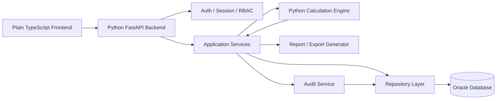
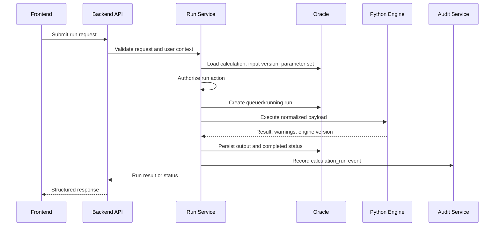

# Technical Architecture Scaffold

## 1. Architecture Intent

The application should use TypeScript for the frontend and Python for backend APIs and calculation logic. Oracle is the system of record, but only the Python backend may connect to Oracle. The frontend consumes typed API contracts and never contains financial formulas, permission logic, or database access.

## 2. Logical Architecture



## 3. Primary Boundaries

| Boundary | Owns | Must not own |
|---|---|---|
| Frontend | Navigation, form UX, tables, client-side display state, typed API calls. | Calculation formulas, database access, authoritative permissions. |
| API routers | HTTP contracts, request parsing, response formatting, dependency wiring. | Business logic, formulas, direct SQL. |
| Services | Workflow orchestration, authorization calls, validation coordination, audit calls. | UI details, SQL embedded in routes. |
| Repositories | Oracle reads/writes, query shape, transaction boundaries. | Calculation formulas, HTTP response formatting. |
| Calculation engine | Deterministic calculations, calculation validation, warnings, engine version. | User sessions, frontend state, Oracle table ownership unless explicitly isolated. |
| Report/export layer | Report generation, file metadata, export permissions coordination. | Raw permission decisions without service authorization. |
| Audit service | Append-only sensitive event records. | Secrets or full unredacted payloads when not required. |

## 4. Future Repository Shape

This is a target shape only and should not be created until implementation begins.

```text
external-calculator/
  frontend/
    src/
      app/
      api/
      features/
      routes/
      styles/
      types/
      utils/
  backend/
    app/
      api/
      core/
      services/
      repositories/
      schemas/
      models/
      calc_engine/
      reports/
      db/
    tests/
  database/
    design/
    migrations/
  docs/
```

## 5. Frontend Architecture

### 5.1 Responsibilities

- Render role-aware application shell with plain TypeScript, HTML, CSS, and browser DOM APIs.
- Display business and admin screens.
- Collect structured input payloads.
- Show validation, permission, loading, warning, and error states.
- Consume typed API helper modules built on standard `fetch`.
- Keep client-side state local and explicit.
- Poll or subscribe to run/batch status where needed.

### 5.2 Feature Areas

| Feature | Purpose |
|---|---|
| auth | Login, account creation, current user, pending approval. |
| dashboard | Business and admin landing pages. |
| calculations | Deals table, setup, output, run history. |
| scenarios | Scenario create/copy/edit/compare. |
| batch | Upload, validation, row status, batch export. |
| reports | Report list, generation, download metadata. |
| sharing | Share modal and permission labels. |
| comments | Resource comment panel. |
| tasks | Task list, task pop-out, assignments. |
| admin | Users, parameters, templates, output explorer. |
| audit | Resource history and admin audit search. |

### 5.3 Frontend Rules

- Use strict TypeScript.
- Do not use a frontend application framework or client-side data library.
- Use standard npm scripts for type checking, building, and local development.
- Use native browser APIs for DOM rendering, events, forms, and `fetch` requests.
- Keep API calls centralized.
- Treat backend responses as authoritative.
- Do not silently swallow failed API calls.
- Do not hide forbidden actions if showing them disabled with a reason improves clarity.
- Keep business and admin route modules separate.
- Use reusable TypeScript modules for table, filter, form, modal, drawer, status badge, and empty state behavior.

## 6. Backend Architecture

### 6.1 Responsibilities

- Authenticate users and create sessions/tokens.
- Enforce RBAC and object-level permissions.
- Validate requests with schema models.
- Orchestrate calculations and batch jobs.
- Persist data through repository layer.
- Invoke isolated Python calculation engine.
- Generate reports and exports.
- Create audit events for sensitive activity.

### 6.2 Service Areas

| Service | Purpose |
|---|---|
| AuthService | Login, password hashing, current user, session lifecycle. |
| UserService | Account approval, role changes, disabled users. |
| WorkspaceService | Personal workspace and access. |
| CalculationService | Create/edit/save/delete calculations and input versions. |
| ScenarioService | Scenario creation, overrides, comparison orchestration. |
| ParameterService | Draft/publish/deprecate parameter sets. |
| RunService | Queue/run/rerun calculation execution. |
| BatchService | Upload, validate, run batch jobs, row errors. |
| ReportService | Report generation and download metadata. |
| SharingService | Share grants and revocation. |
| CommentTaskService | Comments, tasks, notifications. |
| AuditService | Append-only audit events and scoped history. |

### 6.3 Backend Rules

- Every protected endpoint calls authorization.
- Published parameter sets are immutable.
- Reruns create new run records.
- Route handlers do not contain formulas.
- Route handlers do not contain SQL.
- Repositories do not decide user permissions.
- Audit creation is part of service workflows, not optional UI behavior.

## 7. Calculation Engine Architecture

The calculation engine is a Python package/module owned by the backend boundary for the first implementation. It should be isolated enough that it can later move to a separate service if model governance requires it.

### 7.1 Engine Responsibilities

- Accept a normalized calculation request.
- Validate calculation-specific inputs.
- Apply admin-controlled parameter values.
- Produce deterministic outputs for fixed inputs and parameters.
- Return structured warnings and errors.
- Expose engine version.
- Keep placeholder formulas isolated from API routes and frontend code.

### 7.2 Execution Flow



## 8. Oracle Access

Oracle access should be controlled through a repository layer. The frontend must never connect to Oracle.

Recommended access pattern:

- API route receives typed request.
- Service authorizes action and coordinates workflow.
- Repository executes parameterized query or ORM-backed operation.
- Service translates persistence records into domain response.
- API returns structured response.

## 9. Security Architecture

### 9.1 Authentication

First release can support local username/SOEID and password with secure password hashing. Enterprise SSO can be added later if required.

### 9.2 Authorization

Authorization has two layers:

- Role-based access for application areas and capabilities.
- Object-level permissions for calculations, scenarios, reports, batch jobs, and workspaces.

Every protected endpoint must verify both layers as needed.

### 9.3 Audit

Audit required for:

- Login success/failure where policy permits.
- Account approval/disable/role change.
- Calculation create/edit/delete.
- Input version creation.
- Run/rerun/cancel.
- Parameter set publish/deprecate.
- Share grant/revoke.
- Export/report download.
- Batch upload/run/export.
- Admin output explorer access where required.

## 10. Operational Model

Early implementation can run calculations synchronously if fast, but the data model and API should support asynchronous status:

- Queued.
- Running.
- Completed.
- Completed with warnings.
- Failed.
- Cancelled.

Batch jobs should be asynchronous from the user's perspective.

## 11. Architecture Acceptance Criteria

The architecture is ready when:

- TypeScript and Python boundaries are clear.
- Oracle is backend-only.
- Calculation formulas are isolated.
- Backend authorization is unavoidable for protected actions.
- Historical run evidence cannot be overwritten by normal edits.
- Business and admin features can evolve without sharing tangled UI state.
- The first implementation slice can prove login, role landing, calculation creation, parameter selection, run persistence, and output review.
